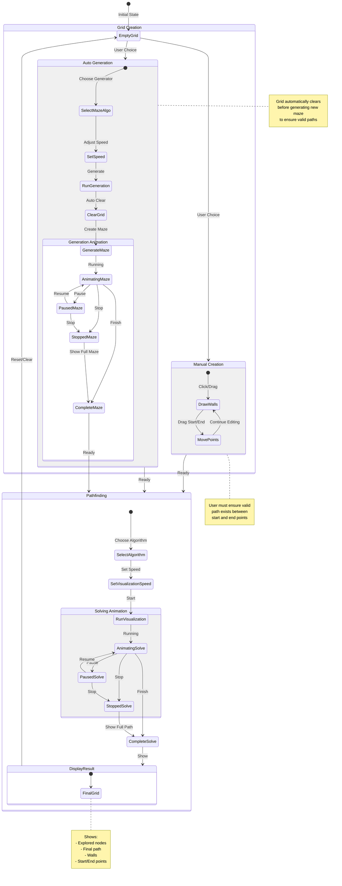

# 🎯 Pathfinding Algorithm Visualizer


[](https://pathfinding-viewer.vercel.app/)

An interactive pathfinding algorithm visualizer built with React and CQRS architecture. Watch algorithms like A\*, Dijkstra, and BFS find their way through mazes in real-time.


## Features

- 🔍 Pathfinding solver algorithms
  - A\* - Fastest path with heuristic
  - Dijkstra - Guaranteed shortest path
  - BFS - Shortest path for unweighted graphs
  - DFS - Memory-efficient path finding
- 🎲 Maze generation algorithms
  - Prim's - Random weighted maze
  - Recursive Division - Room-like structures
  - DFS - Long winding passages
- ⚡ Real-time visualization with step tracking
- 🎮 Interactive grid controls (drag & draw)
- ⏯️ Animation controls with adjustable speed

## Architecture

A proof of concept demonstrating how CQRS (Command Query Responsibility Segregation) can be effectively implemented in a React frontend application. This project showcases clean architecture principles through an interactive pathfinding visualization, separating read and write operations while maintaining a clear boundary between business logic and UI concerns.

```
Application Core
   │
   ├── Domain Layer
   │      ├── Commands (SetAlgorithm, PathfindingRunner)
   │      ├── Events (AnimationCompleted, PathfindingCompleted)
   │      ├── Value Objects (Speed, Algorithm, Grid)
   │      └── Entities (Node, Grid)
   │
   ├── Application Layer
   │      ├── Command Handlers
   │      ├── Event Handlers
   │      ├── Query Handlers
   │      └── Sagas
   │
   ├── Infrastructure Layer
   │      ├── CQRS Implementation
   │      ├── Store Management
   │      ├── Animation Manager
   │      └── Data Structures
   │
   └── Presentation Layer
         ├── Components
         ├── Hooks
         └── View Models
```

## Usage

The visualizer supports two modes of operation:

### Manual Mode

Create custom mazes and obstacles:

- Draw walls by clicking/dragging
- Place start and end points
- Design custom scenarios

### Automatic Mode

Let algorithms generate mazes:

- Choose a maze generation algorithm
- Grid auto-clears before generation
- Ensures valid path existence



### Algorithm Controls

- Start/Stop visualization
- Adjust animation speed
- Reset grid
- Clear path/walls
- Swap start/end points

## Getting Started

1. Clone the repository

```bash
git clone https://github.com/Lokicoule/pathfinding-visualizer.git
```

2. Install dependencies

```bash
npm install
```

3. Start the development server

```bash
npm run dev
```

## Contributing

1. Fork the repository
2. Create your feature branch (`git checkout -b feature/AmazingFeature`)
3. Commit your changes (`git commit -m 'Add some AmazingFeature'`)
4. Push to the branch (`git push origin feature/AmazingFeature`)
5. Open a Pull Request

## License

This project is licensed under the MIT License - see the [LICENSE.md](LICENSE.md) file for details.
